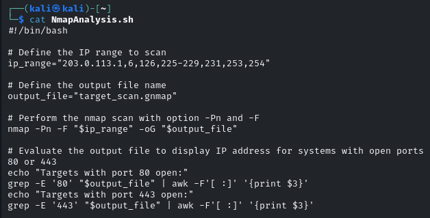
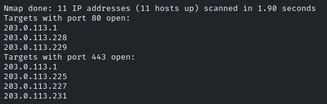
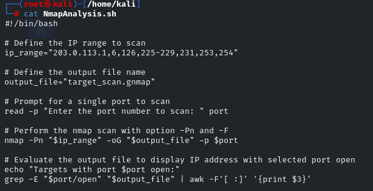
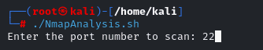
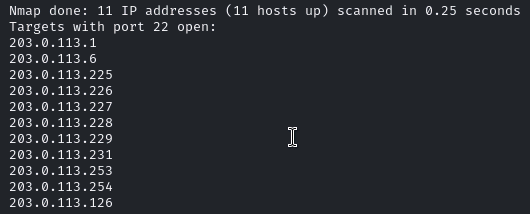

# Using Bash to Automate Reconnaissance

## Mission

Learn about the benefits of using scripting for reconnaissance, automating analysis of findings, and performing data gathering via script searches.

## Environment

- **VM named "KALI"** - hosting Kali Linux

---

## Script #1: Basic Web Service Scanner



### What Is Script Is Doing?

```bash
ip_range="203.0.113.1,6,126,225-229,231,253,254"
```

This defines specific IP addresses and IP ranges to scan.

```bash
output_file="target_scan.gnmap"
```

Sets the output filename for the scan results.

```bash
nmap -Pn -F "$ip_range" -oG "$output_file"
```

- **`-Pn`**: Skip host discovery (assumes all hosts are up - no ping)
- **`-F`**: Fast scan - scans only the top 100 most common ports (not 1,000)
- **`"$ip_range"`**: Scans the specified IP addresses
- **`-oG`**: Output in greppable format for easier parsing with text tools

```bash
echo "Targets with port 80/443 open:"
```

Now filtering results to identify which of the scanned hosts have HTTP (port 80) or HTTPS (port 443) open respectively.

### Ultimate Goal

Quick scan of the top 100 ports across the specified IPs, then extracting which systems are running web services.

### Results

After running the script, we now have easy access to only the information we need:



---

## Limitations & Improvements

While this script works fine, it's only limited to ports 80 and 443. Let's alter it and make it even more unique.

---

## Script #2: Dynamic Port Scanner



### Enhancements

Now we have something a bit more tailor-made for any given task.

#### Added User Prompting for Port Selection



#### Key Changes

We are still running the same nmap command but with a twist:

- **Removed the `-F` flag** because we are now specifying the port we want to scan
- **Modified the output file** to only show us the port that we choose during runtime
- **Interactive prompting** allows for flexible reconnaissance on any port

### Results

This is our new output:



---

## Key Takeaways

1. **Automation saves time** - Instead of manually parsing nmap output, scripts filter exactly what you need
2. **Flexibility matters** - Dynamic port selection makes scripts reusable across different scenarios
3. **Greppable output** - Using `-oG` format makes automated parsing significantly easier
4. **User interaction** - Adding prompts makes scripts more versatile without sacrificing automation

---

## Usage

### Script #1

```bash
chmod +x NmapAnalysis.sh
./NmapAnalysis.sh
```

### Script #2

```bash
chmod +x NmapAnalysis_Enhanced.sh
./NmapAnalysis_Enhanced.sh
# Follow the interactive prompts to specify target port
```

---

## Notes

- Ensure you have proper authorization before scanning any network
- These scripts assume nmap is installed and accessible in your PATH
