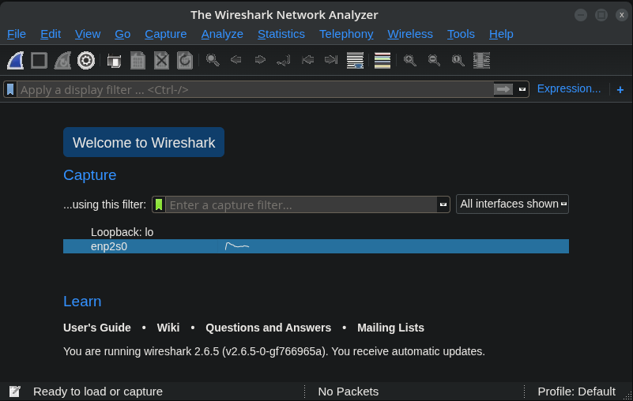
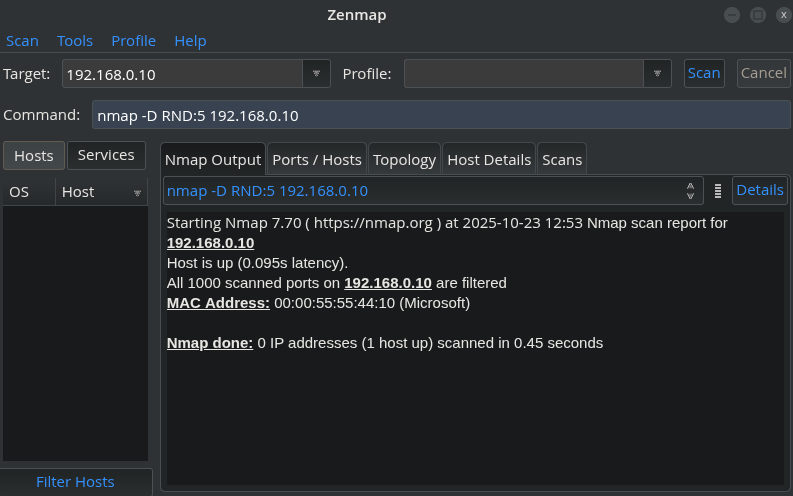
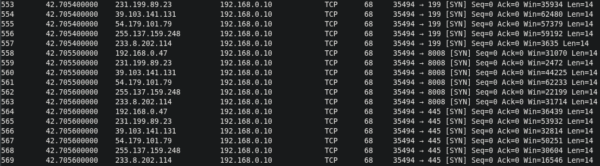

# IDS Evasion with Nmap Decoy Scans

## Mission

Test whether decoy scanning techniques can avoid detection by Intrusion Detection Systems (IDS) on a target network using nmap's decoy functionality.

## Environment

- **VM named "KALI"** - hosting Kali Linux
- **Wireshark** - for network traffic capture and analysis
- **Zenmap** - graphical interface for nmap

---

## Setting Up Traffic Monitoring



Before launching our decoy scan, we need to capture network traffic to analyze the results.

### Steps

1.  Open Wireshark
2.  Select the network interface you want to monitor
3.  Click the blue shark fin icon in the top left to start capturing packets

---

## Executing the Decoy Scan



We're using Zenmap to run our nmap decoy scan with the following command:

```bash
nmap -D RND:5 192.168.0.10

```

### Command Breakdown

**`-D`** - Enables decoy scanning mode

**`RND:5`** - Generates 5 random decoy IP addresses

- **`RND`**: Tells nmap to randomly generate IP addresses
- **`5`**: The number of decoy IPs to create

**`192.168.0.10`** - Target IP address for the decoy scan

### Purpose of Decoy Scanning

**Obfuscation**: Hides your real IP among multiple fake sources

**IDS/IPS Evasion**: Makes it harder for intrusion detection and prevention systems to identify the true source of the scan

**Log Pollution**: Fills target logs with multiple source IPs, complicating forensic analysis and incident response

---

## Analyzing the Results

Once the scan completes, stop the Wireshark capture and examine the traffic.



### What We Found

The destination IP (`192.168.0.10`) received scan traffic from **6 different source IPs**:

- 5 randomly generated decoy IPs
- 1 real attacker IP (your actual source)

### The Challenge

Looking at the captured traffic, can you identify which source IP is the actual attacker?

From the target's perspective, all 6 IPs appear to be conducting scans simultaneously, making it extremely difficult to determine which one is legitimate and which are decoys. This ambiguity is exactly what makes decoy scanning an effective evasion technique.

---

## Key Takeaways

1.  **Decoy scans obscure the true source** - Multiple fake IPs make attribution difficult
2.  **IDS systems see multiple attackers** - Detection systems must now investigate 6 potential threats instead of 1
3.  **Forensic analysis becomes complex** - Security teams cannot easily determine the real attacker from logs alone
4.  **Traffic analysis reveals the technique** - Wireshark allows us to visualize how decoy scanning appears on the network
5.  **Evasion effectiveness** - This technique can bypass basic IDS rules that rely on source IP identification

---

## Usage

### Starting Wireshark Capture

```bash
# Launch Wireshark
sudo wireshark
# Select interface and click the blue shark fin to start

```

### Running the Decoy Scan

```bash
nmap -D RND:5 <target_ip>

```

Or use Zenmap for a graphical interface:

1.  Enter target IP
2.  Input command: `nmap -D RND:5 <target_ip>`
3.  Click "Scan"

### Alternative Decoy Options

```bash
# Specify custom decoy IPs
nmap -D decoy1,decoy2,ME,decoy3 <target_ip>

# Use more decoys for better obfuscation
nmap -D RND:10 <target_ip>

```

---

## Notes

- Always ensure you have proper authorization before performing network scans
- Decoy scanning can generate significant network traffic
- Some advanced IDS/IPS systems may detect decoy patterns through traffic analysis
- This technique is most effective against signature-based detection systems
- Modern security solutions may use behavioral analysis to identify decoy scans
