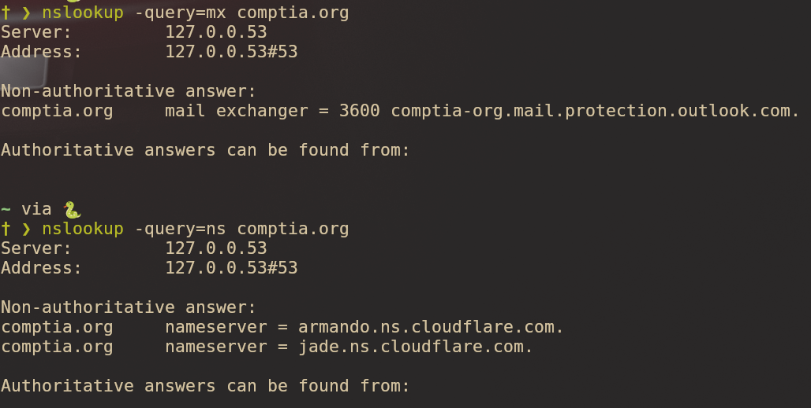
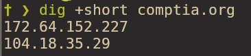

# DNS Enumeration and Reconnaissance

## Mission

Conduct DNS enumeration to gather intelligence on target domains, including registrar information, nameservers, IP addresses, and associated records.

## DNS Enumeration with WHOIS


### What Is WHOIS?

WHOIS is a query and response protocol used to retrieve registration information about domain names and IP addresses.

### Usage

```bash
whois comptia.org

```

### Information Gathered

From the WHOIS query on `comptia.org`, we can identify:

- **Registrar**: GoDaddy.com
- **Registration Date**: 1995
- **Name Servers**:
  - `armando.ns.cloudflare.com`
  - `jade.ns.cloudflare.com`
- **Privacy Protection**: Some fields display "REDACTED FOR PRIVACY" to protect registrant information

This provides a quick way to gather publicly available information about a domain directly from the terminal.

---

## Web-Based WHOIS Lookup

### ARIN (American Registry for Internet Numbers)

**URL**: [https://www.arin.net/](https://www.arin.net/)

ARIN provides similar information to the WHOIS terminal command with additional details:

- IP address ownership
- Related entities and organizations
- Network ranges
- Contact information (when available)

Simply enter an IP address in the search box to retrieve detailed registration data.

---

## IP Geolocation

### IP2Location

**URL**: [https://www.ip2location.com/](https://www.ip2location.com/)


This service provides approximate geographic location data for a target IP address, including:

- Country
- Region/State
- City
- ISP information
- Coordinates (latitude/longitude)

---

## IP Reputation Analysis

### AbuseIPDB

**URL**: [https://www.abuseipdb.com/](https://www.abuseipdb.com/)


After querying the same IP address, we discovered concerning activity:

- **Reports**: Over 40 reports of malicious activity
- **Reported Activities**:
  - Phishing
  - Web application attacks
  - Spoofing
  - Brute-force attempts
  - Email spam
  - Fraud orders

This tool is valuable for determining whether a target IP has a history of malicious behavior.

---

## DNS Enumeration with nslookup


### What Is nslookup?

A command-line tool for querying DNS records to obtain domain name or IP address mappings.

### Basic Usage

```bash
nslookup comptia.org

```

### Output Analysis

- **Server**: `127.0.0.53` (the DNS server providing results)
- **Addresses**: Multiple IP addresses associated with `comptia.org`

This command works for both domains and subdomains.

### Querying Specific Records



You can query specific DNS record types using the `-query` flag:

```bash
nslookup -query=mx comptia.org  # Mail Exchange records
nslookup -query=ns comptia.org  # Name Server records

```

---

## DNS Enumeration with dig


### What Is dig?

Domain Information Groper (dig) is a flexible DNS lookup tool that provides detailed DNS query results.

### Basic Usage

```bash
dig comptia.org

```

### Additional Information Provided

Compared to nslookup, dig offers more detailed output:

- **A Record**: Address record showing the IP address
- **TTL (Time To Live)**: `300` seconds - indicates how long the record remains in cache before a client needs to refetch it
- **Query Time**: `41 ms` - shows response time for the DNS query

Like nslookup, dig can query subdomains as well.

### Querying Specific Records


By default, dig returns A records, but you can specify other record types:

```bash
dig comptia.org MX

```

### Using the +short Option



The `+short` option provides concise output, making it ideal for scripting:

```bash
dig comptia.org +short

```

This returns only the essential information, making it easier to parse results in automated reconnaissance scripts.

---

## Key Takeaways

1.  **WHOIS provides foundational intelligence** - Registrar information, nameservers, and registration dates
2.  **Multiple sources enhance reconnaissance** - Combining terminal tools with web-based services gives a complete picture
3.  **IP reputation matters** - Always check if target IPs have a history of malicious activity
4.  **dig offers more detail than nslookup** - TTL and query time provide additional context
5.  **Script-friendly output** - Tools like `dig +short` make automation easier

---

## Usage

### WHOIS Lookup

```bash
whois <domain>

```

### nslookup Commands

```bash
nslookup <domain>
nslookup -query=<record_type> <domain>

```

### dig Commands

```bash
dig <domain>
dig <domain> <record_type>
dig <domain> +short

```

---

## Notes

- Always ensure you have proper authorization before conducting reconnaissance on any network or system
- DNS enumeration is typically part of the information gathering phase in security assessments
- Results from different tools can vary based on DNS caching and propagation delays
